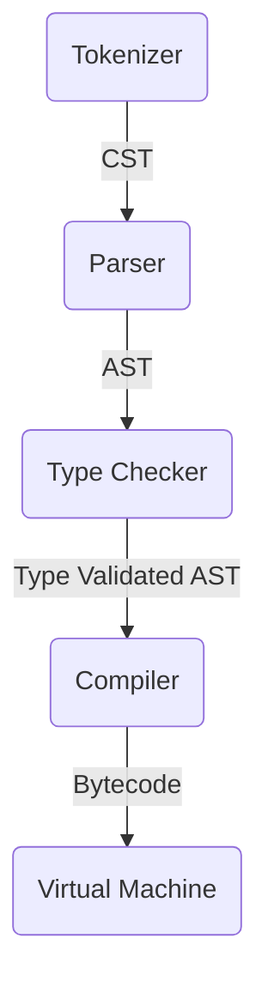

# TyPy

_**Ty**ped **Py**thon_

> ⚠️ Under Developing

Programming Language fully inspired by Python. The Goal of it is to build clean and maintanable code using best of Python world. That's why this language is:

1. Static Typed
2. Simple
3. Small

## Quick Start

We also support REPL:

```bash
$ typy
=== TyPy (v 0.1.0) ===
>>> a: int = 10
10
>>> b: int = 20
20
>>> b * a
200
```

## Contributing

### Architecture

Language written in Rust using stack virtual machine. All code goes through next steps:



### Making PR

Before making PR, be sure that your code is successful:

1. Formatted `cargo fmt --all -- --check`
2. Linted `cargo clippy --locked --all-targets --all-features -- -D warnings`
3. Tested `cargo test --locked --all-features --verbose`
4. Built `cargo build --locked --verbose`